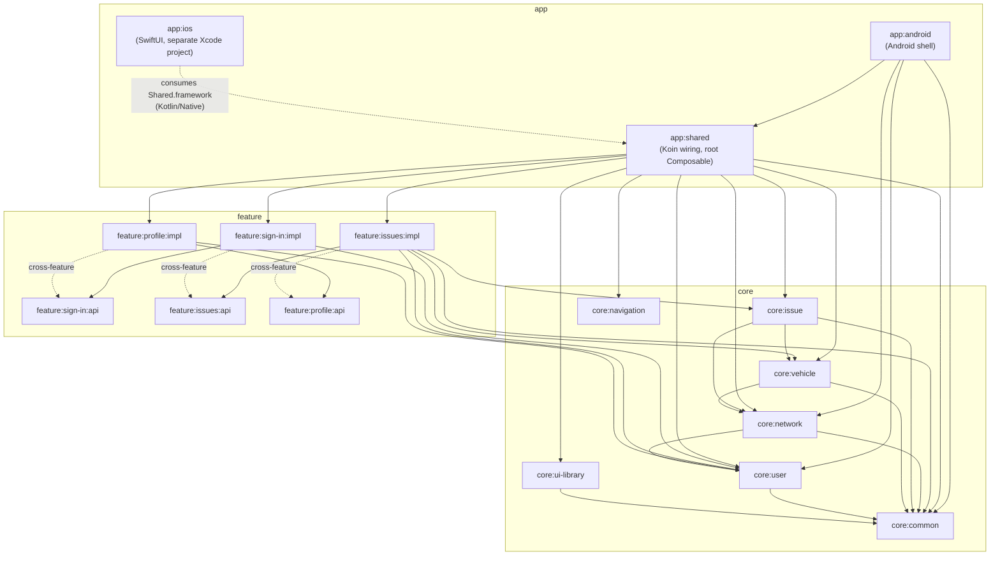

# TruckTrack

[](https://github.com/piskula/TruckerTracker-client/actions/workflows/build-app.yml)
[](https://github.com/piskula/TruckerTracker-client/actions/workflows/release-app.yml)

Fleet management app for drivers and mechanics — report and track issues, manage vehicles, sign in
via OAuth/OIDC. Kotlin Multiplatform, targeting Android and iOS from one shared codebase.

## Contents

- [Features](#features)
- [Tech stack](#tech-stack)
- [Getting started](#getting-started)
- [Continuous integration](#continuous-integration)
- [Project structure](#project-structure)
- [Testing](#testing)
- [Releasing](#releasing)
- [Contributing](#contributing)
- [Docs](#docs)

## Features

- **Sign in** — OAuth/OIDC authentication via AppAuth.
- **Issues** — drivers and mechanics report, view, and track vehicle issues by status and priority.
- **Profile** — user account details.
- **Vehicles** — vehicle records backing issue tracking (domain layer today; no dedicated screen
  yet).

## Tech stack

| Concern | Choice |
|---------|--------|
| UI | Compose Multiplatform (`org.jetbrains.compose`) |
| Navigation | Navigation 3 (`androidx.navigation3` + `org.jetbrains.androidx.navigation3:navigation3-ui`) |
| ViewModel | AndroidX ViewModel |
| DI | Koin |
| HTTP | Ktor Client |
| Logging | Kermit |
| Crash reporting | Firebase Crashlytics via [`dev.gitlive:firebase-crashlytics`](https://github.com/GitLiveApp/firebase-kotlin-sdk) |
| Serialization | Kotlinx Serialization |
| Auth / OIDC | [kotlin-multiplatform-oidc](https://github.com/kalinjul/kotlin-multiplatform-oidc) |

## Getting started

### Prerequisites

| Tool | Needed for | Check | Auth |
|---|---|---|---|
| JDK 21 | Gradle toolchain (`jvmToolchain(21)`, all modules) | `java -version` | — |
| Android SDK (cmdline-tools, platform 37, build-tools) | `./gradlew :app:android:assembleDebug`, Android Studio | Android SDK path env var set (`ANDROID_HOME`) | — |
| Xcode 15+ + command line tools (**macOS only**) | Building `app:ios` | `xcode-select -p` | — |
| CocoaPods (**macOS only**) | Linking Firebase into `app:ios` (`app/ios/Podfile`) | `pod --version` | — |
| [`gh`](https://cli.github.com/) (GitHub CLI) | Agents inspecting CI runs/PRs/releases (`analyze-ci-failure`, `release-app` skills) | `gh auth status` | `gh auth login` |
| Node.js 20+ (current LTS) | Runs the Firebase MCP server via `npx` | `node --version` | — |
| [`firebase-tools`](https://firebase.google.com/docs/cli) | Firebase App Distribution setup, Crashlytics analysis, and the underlying tool the Firebase MCP server wraps | `firebase --version` | `firebase login` |

Run the **`setup-local-tools`** skill (`.claude/skills/setup-local-tools/SKILL.md`) to check which
of these are present/authenticated on your machine and get exact install commands for anything
missing.

### Build & run

Both platforms need a local Firebase config file first — neither is committed (see
`.claude/skills/setup-local-tools/SKILL.md`, "Firebase config files for local builds", for how to
get them): `app/android/google-services.json` and `app/ios/iosApp/GoogleService-Info.plist`.

**Android** — `./gradlew :app:android:assembleDebug`, or open the project in Android Studio and
run the `app:android` configuration.

**iOS** — run `pod install` in `app/ios` (generates `iosApp.xcworkspace`), then open
`app/ios/iosApp.xcworkspace` (not the `.xcodeproj`) in Xcode (15+) and run.

## Continuous integration

Two GitHub Actions workflows run remotely — nothing to install locally to trigger them. `gh run
list` / `gh run view` (see the `analyze-ci-failure` skill) are the fastest way to inspect a run
without leaving the terminal.

### On every push to `main` (`build-app.yml`)

- **`build-android`** — assembles a debug APK.
- **`build-ios`** — builds a signed, device-installable `.ipa` if the iOS signing secrets (see
  [Releasing](#releasing)) are configured; otherwise falls back to an unsigned iOS Simulator app
  (see `docs/KMP_IOS_READINESS.md`).
- **`publish-release`** — replaces the assets on the repo's `latest` pre-release with whichever
  build(s) succeeded (publishes a partial release rather than blocking on both).
- **`distribute-android`** — pushes the debug APK to the `internal-testers` group in Firebase App
  Distribution.
- **`distribute-ios`** — pushes the signed `.ipa` to the `internal-testers` group in Firebase App
  Distribution. Skipped when the iOS signing secrets aren't configured.
- Skipped entirely for doc-only changes (`paths-ignore`: `**/*.md`, `.claude/**`, `docs/**`).

### On pushing a version tag (`release-app.yml`)

- **`release-android`** — builds a signed release APK/AAB, publishes them as a GitHub Release
  named after the tag, and distributes the APK to the `release` group in Firebase App
  Distribution.
- **`release-ios`** — builds a signed `.ipa` (same tag-derived version), attaches it to the GitHub
  Release, and distributes it to the `release` group in Firebase App Distribution. Skipped (with a
  warning) when the iOS signing secrets aren't configured.
- See [Releasing](#releasing) for the tag format and required secrets.

## Project structure

Multi-module KMP project — `app:*` (platform shells + shared app wiring), `core:*` (domain logic,
infra), `feature:*/api` + `feature:*/impl` (product features). See **`AGENTS.MD`** for the full
module map, dependency rules, and coding conventions — that's the canonical reference for
contributing here (including for AI coding agents).

<details>
<summary>Module dependency graph</summary>



Solid arrows are `implementation`/`api` project dependencies (`settings.gradle.kts` +
`build.gradle.kts` across all modules); the dotted `cross-feature` arrows are `*/impl → other
feature's */api` edges that exist in the current codebase despite `AGENTS.MD`'s "no cross-feature
dependencies" rule — worth a look before adding new ones. `core` modules form a DAG rooted at
`core:common` (everything depends on it, directly or transitively; nothing depends back), and
`core:navigation` has no internal dependencies at all.

</details>

## Testing

No automated tests exist yet. When adding them, follow the conventions in `AGENTS.MD`:

- **MockK** for mocking, **Turbine** for `Flow` testing, **kotlinx-coroutines-test** (`runTest`)
  for coroutines.
- Shared tests go in `src/commonTest/kotlin/`, Android-specific tests in
  `src/androidTest/kotlin/`, mirroring the main source package.

## Releasing

A signed release (`.github/workflows/release-app.yml`) is cut by pushing a version tag — there's
no separate version bump commit, the tag *is* the version:

```bash
git tag v1.2.3
git push origin v1.2.3
```

- Tag must match `vMAJOR.MINOR.PATCH`, with `MINOR` and `PATCH` each under 100 (so
  `versionCode = MAJOR * 10000 + MINOR * 100 + PATCH` can't collide across versions).
- **Android** — produces a signed `truck-track-<version>.apk` and `truck-track-<version>.aab`,
  both built with `versionName`/`versionCode` embedded from the tag, published as a GitHub Release
  named after the tag. Requires four repo secrets: `ANDROID_KEYSTORE_BASE64`,
  `ANDROID_KEYSTORE_PASSWORD`, `ANDROID_KEY_ALIAS`, `ANDROID_KEY_PASSWORD`.
- **iOS** — produces a signed `truck-track-<version>.ipa` (same `MARKETING_VERSION`/
  `CURRENT_PROJECT_VERSION` derived from the tag), attached to the same GitHub Release. Requires
  five repo secrets: `IOS_TEAM_ID`, `IOS_DISTRIBUTION_CERTIFICATE_BASE64`,
  `IOS_DISTRIBUTION_CERTIFICATE_PASSWORD`, `IOS_PROVISIONING_PROFILE_BASE64`,
  `FIREBASE_IOS_APP_ID`. Until an Apple Developer account and ad-hoc provisioning profile exist,
  this step is skipped with a warning rather than failing the release (see
  `docs/KMP_IOS_READINESS.md`).
- Both platforms' builds are also distributed to their `release` group in Firebase App
  Distribution.

## Contributing

- **`AGENTS.MD`** is the canonical reference for architecture (MVVM), module rules, and coding
  conventions — read it before making structural changes.
- Run `./gradlew spotlessApply` to auto-format before committing (ktlint + compose-rules-ktlint).
- `.claude/skills/` has reusable step-by-step workflows for common tasks (scaffolding a feature
  module, adding a screen, adding a repository, fixing Spotless violations, diagnosing CI
  failures, cutting a release, onboarding a new machine).

## Docs

- **`AGENTS.MD`** — module structure, dependency rules, architecture (MVVM), coding conventions.
- **`docs/KMP_IOS_READINESS.md`** — known iOS-specific limitations and how to resolve them.
- **`docs/TODO.md`** — product feature backlog.
- **`.claude/skills/`** — reusable agent workflows, including `setup-local-tools` for onboarding a
  new machine (see [Getting started](#getting-started)).
