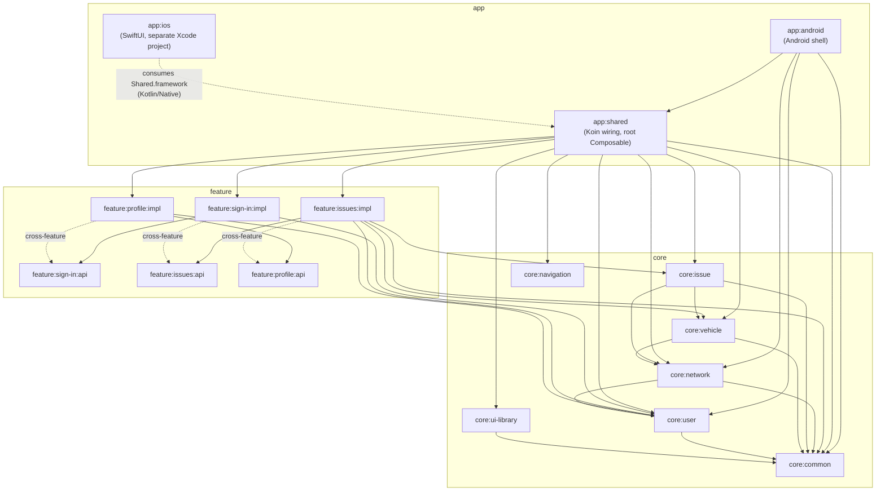

# TruckTrack

[](https://github.com/piskula/TruckerTracker-client/actions/workflows/build-app.yml)
[](https://github.com/piskula/TruckerTracker-client/actions/workflows/release-app.yml)

Fleet management app for drivers and mechanics — report and track issues, manage vehicles, sign in
via OAuth/OIDC. Kotlin Multiplatform, targeting Android and iOS from one shared codebase.

## Tech stack

| Concern | Choice |
|---------|--------|
| UI | Compose Multiplatform (`org.jetbrains.compose`) |
| Navigation | Navigation 3 (`androidx.navigation3` + `org.jetbrains.androidx.navigation3:navigation3-ui`) |
| ViewModel | AndroidX ViewModel |
| DI | Koin |
| HTTP | Ktor Client |
| Logging | Kermit |
| Serialization | Kotlinx Serialization |
| Auth / OIDC | [kotlin-multiplatform-oidc](https://github.com/kalinjul/kotlin-multiplatform-oidc) |

## Project structure

Multi-module KMP project — `app:*` (platform shells + shared app wiring), `core:*` (domain logic,
infra), `feature:*/api` + `feature:*/impl` (product features). See **`AGENTS.MD`** for the full
module map, dependency rules, and coding conventions — that's the canonical reference for
contributing here (including for AI coding agents).

### Module dependencies



Solid arrows are `implementation`/`api` project dependencies (`settings.gradle.kts` +
`build.gradle.kts` across all modules); the dotted `cross-feature` arrows are `*/impl → other
feature's */api` edges that exist in the current codebase despite `AGENTS.MD`'s "no cross-feature
dependencies" rule — worth a look before adding new ones. `core` modules form a DAG rooted at
`core:common` (everything depends on it, directly or transitively; nothing depends back), and
`core:navigation` has no internal dependencies at all.

## Building & running

**Android** — `./gradlew :app:android:assembleDebug`, or open the project in Android Studio and
run the `app:android` configuration.

**iOS** — open `app/ios/iosApp.xcodeproj` in Xcode (15+) and run. See
**`docs/KMP_IOS_READINESS.md`** for current known iOS limitations before relying on a build —
notably, sign-in has not yet been verified end-to-end on a device or simulator.

CI builds both on every push to `main` (`.github/workflows/build-app.yml`) and publishes a debug
APK and an unsigned iOS Simulator build to the repo's `latest` pre-release.

## Environment setup

What a machine needs to build the app and to let an AI coding agent (Claude Code, etc.) work in
this repo at full capability:

| Tool | Needed for | Check | Auth |
|---|---|---|---|
| JDK 21 | Gradle toolchain (`jvmToolchain(21)`, all modules) | `java -version` | — |
| Android SDK (cmdline-tools, platform 37, build-tools) | `./gradlew :app:android:assembleDebug`, Android Studio | Android SDK path env var set (`ANDROID_HOME`) | — |
| Xcode 15+ + command line tools (**macOS only**) | Building `app:ios` | `xcode-select -p` | — |
| [`gh`](https://cli.github.com/) (GitHub CLI) | Agents inspecting CI runs/PRs/releases (`analyze-ci-failure`, `release-app` skills) | `gh auth status` | `gh auth login` |
| Docker | Runs the GitHub MCP server declared in `.mcp.json` | `docker info` | — |
| Node.js 20+ (current LTS) | Runs the Firebase MCP server via `npx` | `node --version` | — |
| [`firebase-tools`](https://firebase.google.com/docs/cli) | Agents/humans inspecting or managing the Firebase project (Firestore, Auth, Remote Config, Crashlytics, …) | `firebase --version` | `firebase login` |

Both MCP servers (GitHub and Firebase) are declared in `.mcp.json`, checked into the repo — no
per-machine MCP config needed beyond having Docker/Node available and being authenticated.

Run the **`setup-local-tools`** skill (`.claude/skills/setup-local-tools/SKILL.md`) to check which
of these are present/authenticated on your machine and get exact install commands for anything
missing.

## Releasing

A signed Android release (`.github/workflows/release-app.yml`) is cut by pushing a version tag —
there's no separate version bump commit, the tag *is* the version:

```bash
git tag v1.2.3
git push origin v1.2.3
```

- Tag must match `vMAJOR.MINOR.PATCH`, with `MINOR` and `PATCH` each under 100 (so
  `versionCode = MAJOR * 10000 + MINOR * 100 + PATCH` can't collide across versions).
- Produces a signed `truck-track-<version>.apk` and `truck-track-<version>.aab`, both built with
  `versionName`/`versionCode` embedded from the tag, published as a GitHub Release named after the
  tag.
- Requires four repo secrets already configured: `ANDROID_KEYSTORE_BASE64`,
  `ANDROID_KEYSTORE_PASSWORD`, `ANDROID_KEY_ALIAS`, `ANDROID_KEY_PASSWORD`.
- iOS has no equivalent signed release pipeline yet — no distribution certificate/provisioning
  profile is configured (see `docs/KMP_IOS_READINESS.md`).

## Docs

- **`AGENTS.MD`** — module structure, dependency rules, architecture (MVVM), coding conventions.
- **`docs/KMP_IOS_READINESS.md`** — known iOS-specific limitations and how to resolve them.
- **`docs/TODO.md`** — product feature backlog.
- **`.claude/skills/`** — reusable agent workflows, including `setup-local-tools` for onboarding a
  new machine (see [Environment setup](#environment-setup)).
